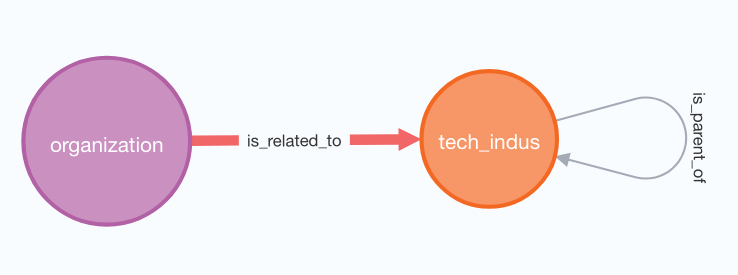
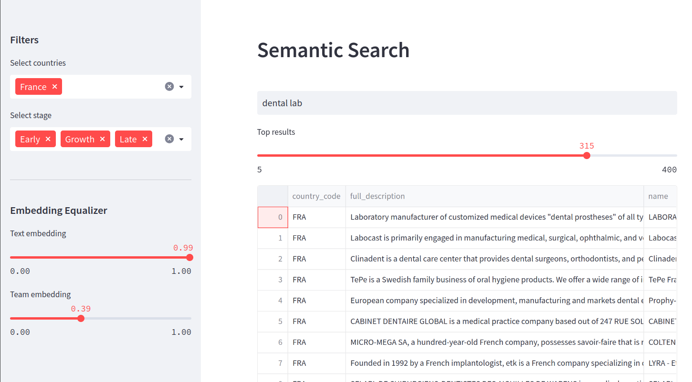

# Chroma DB with Matching KG

Several  python codes implements a Chroma vector store for Matching KG hosted on an VM with neo4j instance. [Matching KG http://52.236.176.143:7474](http://52.236.176.143:7474/)

The graph has a simple ontology (schema)


 - Full description of all companies were embedded by sentBERT previously. It creates *text embedding* vectors in Chroma. 
 - Additionally few attributes about a team of a company were encoded in small size embedding vector and stored in separated *team embedding* collection in Chroma. 

- We retrieve company data from neo4j instance along metadata with precalculated embeddings 
- When we ingest companies data to Chroma we add metadata - country and stage of a company 
- We use metadata to filter results of semantic search retrieval from Chroma vectorestore
- We retrieve top N results by semantic search using a company description embedding only 
- We retrieve both embedding vectors for all results
- We re-rank results based on weights to prioritize team similarity score over text similarity score 
- A user can adjust weights in real time. 


## Code for ingestion and processing 

The code provided demonstrates the data ingestion process for the Chroma Vectorstore database using Python. Here's a breakdown of the code:

```python
import chromadb
from chromadb.config import Settings
from chromadb.utils import embedding_functions
import numpy as np
from py2neo import Graph as neoGraph
```
The code begins by importing the necessary libraries, including `chromadb` for interacting with the Chroma Vectorstore database, `numpy` for numerical operations, and `py2neo` for working with Neo4j databases.

```python
from secrets import *
```
The code imports the `secrets` module, which presumably contains sensitive information such as database credentials. This module is not provided in the code snippet, but it is likely used to securely store and access the necessary authentication details.

```python
LIST = """
MATCH (c:organization)
WHERE c.embedding is NOT NULL
RETURN Id(c) AS ID, 
       c.embedding AS embedding 
       SKIP $skp LIMIT $topn
"""

CNT = """
MATCH (c:organization)
RETURN count(c) AS cnt
"""

GETIDS = """
MATCH (c:organization)
WHERE Id(c) in $idlist
RETURN Id(c) AS ID, c.name AS name, c.full_description AS description
"""
```
These are Neo4j query strings defined as multi-line strings. They are used to retrieve data from the Neo4j graph database. `LIST` retrieves the organization IDs and corresponding embeddings, `CNT` returns the total count of organizations, and `GETIDS` retrieves the IDs, names, and descriptions of organizations based on a list of IDs.

```python
graph = neoGraph(NEO4J_LINK, auth=NEO4J_AUTH, name=NEO4J_DATABASE)
model = 'all-mpnet-base-v2'
st_model = embedding_functions.SentenceTransformerEmbeddingFunction(model_name=model)
```
A Neo4j graph object is created using the provided `NEO4J_LINK`, `NEO4J_AUTH`, and `NEO4J_DATABASE` variables, which represent the connection details to the Neo4j database. The `model` variable specifies the name of the sentence transformer model to be used. An instance of the `SentenceTransformerEmbeddingFunction` class is created using the model name.

```python
CREATE = False
if CREATE:
    chroma_client = chromadb.Client(Settings(
                            chroma_db_impl="duckdb+parquet",
                            persist_directory=".chromaDB"))
    collectTE = chroma_client.create_collection(name="match_graph", embedding_function=st_model)
    num_comp =  graph.run(CNT).data()[0]["cnt"]
    topN = 100000
    for sk in range(0,num_comp,topN):
        res = graph.run(LIST, topn=topN, skp = sk).to_data_frame()
        collectTE.add(
                embeddings=list(res["embedding"]),
                ids=list(res["ID"].astype("str")))
        print(f"Embeded {len(res)} companies starting from {sk}  \n")
        del res
    chroma_client.persist()
```
This block of code handles the creation and ingestion of data into the Chroma Vectorstore database. If `CREATE` is set to `True`, a `chromadb.Client` object is created with the appropriate settings. Then, a collection named "match_graph" is created using `chroma_client.create_collection()`, specifying the name and the embedding function. The `num_comp` variable is assigned the total count of organizations in the Neo4j database by executing the `CNT` query. The `topN` variable determines the number of organizations to embed in each iteration.


## Front-end
The front-end application for this project was implemented using the Streamlit framework. Streamlit is a popular open-source framework that makes it easy to create web applications with Python. It allows developers to quickly create interactive and responsive applications without the need for extensive web development experience. Streamlit provides a user-friendly interface that can be customized to meet the specific needs of the project.

 
