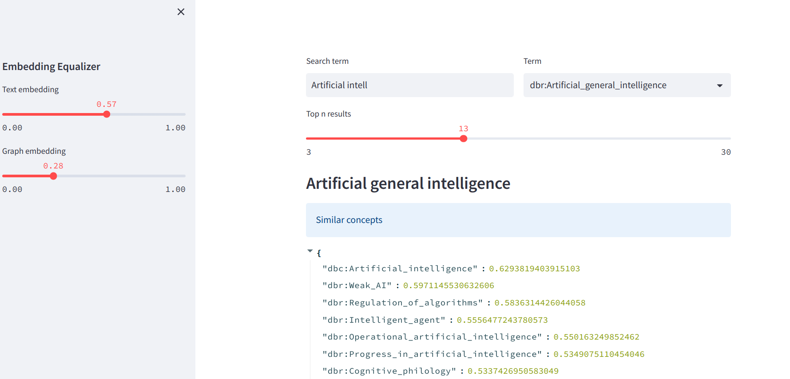

# README

This python code implements a Chroma vector store for collections of text and graph embeddings.

## Chroma

[https://docs.trychroma.com/](https://docs.trychroma.com/) is the open-source embedding database. Chroma makes it easy to build LLM apps by making knowledge, facts, and skills pluggable for LLMs. Chroma gives you the tools to:

 - store embeddings and their metadata
 - embed documents and queries
 - search embeddings

Chroma prioritizes:
 - simplicity and developer productivity
 - analysis on top of search
 - it also happens to be very quick


The code imports several libraries: `networkx`, `karateclub`, `chromadb`, `stellargraph`, `gensim`, `sentence_transformers`, `numpy`, `sys`, and `plotly.express`.

In the first part of the code, it reads a graph from a file `AIB_SD.graphml`. The graph is stored in a NetworkX object `G`. The code then creates a Chroma database, which is a collection of text embeddings and a collection of node embeddings from the graph. The collections are named "taxo_graph" and "node2vec_taxo_graph," respectively. The text embeddings are created using the SentenceTransformers library, and the node embeddings are created using the node2vec algorithm from the karateclub library.

The `load_DB` function loads the Chroma database.

The `search_concept` function searches the text embeddings for a concept, given as a string `txt`. The function returns the top `n` results, where `n` is specified by the argument `topN`.

The `get_top_scores` function returns the top `n` text and node embeddings that are most similar to a prototype, given by an ID `iD`. The argument `topN` specifies the number of embeddings to return.

The code also includes a `scoring` function that combines the text and node embeddings for a concept using a weighted average. The function returns a dictionary of IDs and scores, sorted by score in descending order. 

Finally, the code includes a sample prototype `iD` and topN `20` to run the `get_top_scores` function. The resulting embeddings are then visualized using plotly express.


## Croma Vectorstore collections of text and graph embeddings

This Python code provides a collection of functions to work with Croma vectorstore collections of text and graph embeddings.

The code relies on several Python libraries, including:
- `networkx`: for the creation of graph structures;
- `karateclub`: for the implementation of graph embedding algorithms;
- `chromadb`: for the creation and manipulation of vectorstore collections;
- `stellargraph`: for the creation of graph structures and the implementation of graph embedding algorithms;
- `gensim`: for the implementation of the word2vec algorithm;
- `sentence_transformers`: for the implementation of text embeddings;
- `numpy`: for numerical computing and data manipulation;
- `sys`: for system-specific parameters and functions; and
- `plotly.express`: for data visualization.

## Functionality

The code provides the following functionalities:
- Creation of vectorstore collections of graph and text embeddings based on a given graph;
- Querying vectorstore collections for nodes or texts with similar embeddings;
- Comparison of text and graph embeddings for a given node based on cosine similarity scores;
- Calculation of a combined score based on the cosine similarity scores between the text and graph embeddings;
- Visualization of the top nodes based on their combined score.

## Usage

The Python code can be used as follows:

1. Import the required libraries and functions.

```python
import networkx as nx
from karateclub import Diff2Vec, Node2Vec
import chromadb
from chromadb.config import Settings
from stellargraph.data import BiasedRandomWalk
from gensim.models import Word2Vec
from stellargraph import StellarGraph
from sentence_transformers import util 
import numpy as np
import sys
sys.path.append("/home/sergei/ALPHA10X/RD_Projects/KG_KnowledgeGraphs/ALPHA_GENOME/Taxo_Sem_drift/src/")
from taxo2vec import Taxo
import plotly.express as px
```

2. Load a graph and create a vectorstore collection of text and graph embeddings.

```python
fin = f"../data/AIB_SD.graphml"
G = nx.read_graphml(fin)

# Create collection
CREATE = True

if CREATE:
    TxG = Taxo(G)
    TxG.abstr2corpus()
    sG = StellarGraph.from_networkx(G)
    docs = nx.get_node_attributes(G,"name")
    docs = {k:v +". "+G.nodes[k]["abstract"] if "abstract" in G.nodes[k] else v for k,v in docs.items()}

    chroma_client = chromadb.Client(Settings(
                            chroma_db_impl="duckdb+parquet",
                            persist_directory=".chromaDDB"))
    
    collectTE = chroma_client.create_collection(name="taxo_graph")
    collectTE.add(
        documents=TxG.docs,
        ids=TxG.docs_ids
    )
    
    # Node embedding
    rw = BiasedRandomWalk(sG)

    walks = rw.run(
                nodes=list(sG.nodes()),  # root nodes
                length=3,  # maximum length of a random walk
                n=50,  # number of random walks per root node
                p=0.7,  # Defines (unormalised) probability, 1/p, of returning to source node
                q=0.2,  # Defines (unormalised) probability, 1/q, for moving away from source node
            )


    str_walks = [[str(n) for n in walk] for walk in walks]
    model = Word2Vec(str_walks, window=5, min_count=0, sg=workers=2)
    ne = model.wv.get_normed_vectors()


    collectNE = chroma_client.create_collection(name="node2vec_taxo_graph")
    collectNE.add(
        embeddings=ne.tolist(),
        ids=list(sG.nodes())
    )
    
    chroma_client.persist()
```

## Front-end
The front-end application for this project was implemented using the Streamlit framework. Streamlit is a popular open-source framework that makes it easy to create web applications with Python. It allows developers to quickly create interactive and responsive applications without the need for extensive web development experience. Streamlit provides a user-friendly interface that can be customized to meet the specific needs of the project.


