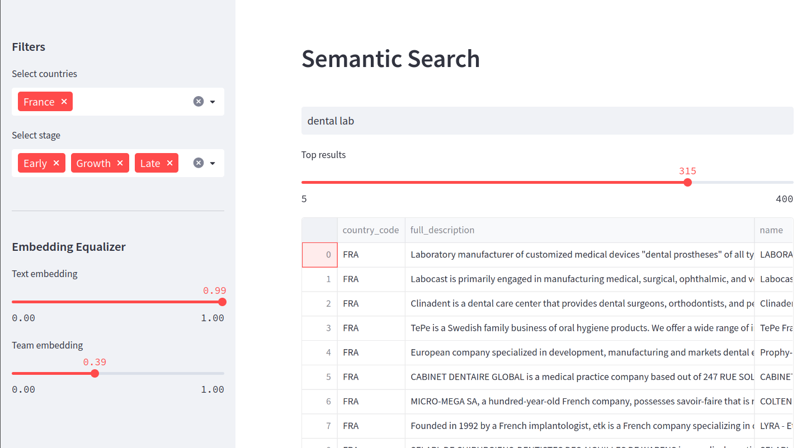

# Qdrant  DB with Matching KG

Several  python codes implements a Qdrant vector store (vector database) for Matching KG hosted on an VM with neo4j instance. [Matching KG http://52.236.176.143:7474](http://52.236.176.143:7474/)

The graph has a simple ontology (schema)


 - Full description of all companies were embedded by sentBERT previously. It creates *text embedding* vectors in Qdrant. 
 - Additionally few attributes about a team of a company were encoded in small size embedding vector and stored in separated *team embedding* in the same collection in Qdrant. 

- We retrieve company data from neo4j instance along metadata with precalculated embeddings
- We calculate team embedding as non-linear normalization function of 10 numerical attributes related to team (ex. "board_members_exits_count", "deg_people", "employee_count", "employee_count_range", "founder_count", "founders_exits_count", "masters_ratio", "phd_ratio", "team_score")   
- When we ingest companies data (text embedding and team embedding) to Qdrant with adding metadata - country and stage of a company
- Qdrant database allows to ingest both embeddings in the same collection: several embedding could have their own proper names. These name can be used in the retrieval process.   
- We use metadata to filter results of semantic search retrieval from Qdrant vector-store
- We retrieve top N results by semantic search using a company description embedding only 
- We retrieve both embedding vectors for all results
- We re-rank results based on weights to prioritize team similarity score over text similarity score 
- A user can adjust weights in real time. 


## Qdrant Vector Database Data Ingestion

This code snippet provides an example of how to ingest data into the Qdrant Vector Database using Python. The Qdrant Vector Database is a high-performance vector storage for similarity search and nearest neighbor retrieval.

### Prerequisites

Before running the code, make sure you have the following:

- Qdrant Vector Database installed and running
- Python installed on your system
- Required dependencies installed (`qdrant-client`, `numpy`, `py2neo`)

### Code Explanation

The code provided performs data ingestion into the Qdrant Vector Database. Let's go through the important parts of the code and understand their functionality.

```python
from qdrant_client import QdrantClient
from qdrant_client import models
import numpy as np
import json
from py2neo import Graph as neoGraph

from secrets import *

graph = neoGraph(NEO4J_LINK, auth=NEO4J_AUTH, name=NEO4J_DATABASE)
```

- The `qdrant_client` library is imported to interact with the Qdrant Vector Database.
- Other required dependencies and modules are imported.
- Neo4j database connection details are provided.

```python
TEAM = """
MATCH (c:organization)
RETURN Id(c) AS ID,
        c.full_description          AS   full_description,
        c.embedding                 AS   embedding,
        ...
       SKIP $skp LIMIT $topn
"""

```

- Several Cypher queries are defined as multiline strings. These queries retrieve the data from the Neo4j database that needs to be ingested into Qdrant Vector Database.

```python
client = QdrantClient(host="localhost", port=6333)
```

- A connection to the Qdrant Vector Database is established using the Qdrant client.

```python
INGEST = False
INDEX = True
```

- Two boolean variables are set to control the execution of the ingestion and indexing processes.

```python
if INGEST:
    client.recreate_collection(
        collection_name='matchingkg',
        vectors_config={
            "text": models.VectorParams(size=768, distance=models.Distance.COSINE),
            "team": models.VectorParams(size=10, distance=models.Distance.EUCLID),
        }
    )

    num_comp = graph.run(CNT).data()[0]["cnt"]
    topN = 1000

    for sk in range(0, num_comp, topN):
        data = graph.run(TEAM, skp=sk, topn=topN).to_data_frame()
        ...

```

- The `INGEST` variable is checked, and if set to `True`, the data ingestion process is executed.
- The `recreate_collection` method is used to create a new collection in Qdrant Vector Database with the specified name ('matchingkg') and vector configurations.
- The data is retrieved from the Neo4j database using the provided Cypher query (`TEAM`).
- The retrieved data is preprocessed and transformed into the required format for ingestion into the Qdrant Vector Database.
- The `upsert` method is used to insert the data into the Qdrant Vector Database in batches.

```python
if INDEX:
    client.create_payload_index(
        collection_name="matchingkg",
        field_name="full_description",
        field_schema=models.TextIndex
```


# Neural Search with Qdrant Vector Database

This code provides an implementation of neural search using the Qdrant vector database. It includes classes and functions to perform searches based on text similarity and vector similarity. The code demonstrates how to use the SentenceTransformer library for text encoding and the QdrantClient library for interacting with the Qdrant database.

## Prerequisites

Before running the code, ensure that you have the following dependencies installed:

- `qdrant_client`
- `sentence_transformers`
- `numpy`
- `pandas`

## Usage

### NeuralSearcher Class

The `NeuralSearcher` class performs a text-based search using neural embeddings. It requires the collection name where the vectors are stored in Qdrant. Here's an example of how to use it:

```python
searcher = NeuralSearcher(collection_name="matchingkg")
results = searcher.search(text="search query")
```

The `search` method takes a `text` parameter as the search query and an optional `filter_` parameter to apply filtering during the search. It returns a list of dictionaries representing the search results.

### Neural Class

The `Neural` class is another implementation of neural search with additional options. It also requires the collection name and an optional model name for the SentenceTransformer. Here's an example of how to use it:

```python
searcher = Neural(collection_name="matchingkg", model_name='all-mpnet-base-v2')
results = searcher.search(text="search query", filter_={'field_name': 'field_value'}, topn=5)
```

The `search` method takes a `text` parameter as the search query, an optional `filter_` parameter for filtering, and an optional `topn` parameter to specify the number of results to retrieve. It returns a list of search results.

### Similarity Class

The `Similarity` class performs a similarity search based on a list of input IDs. It requires the collection name where the vectors are stored in Qdrant. Here's an example of how to use it:

```python
searcher = Similarity(collection_name="matchingkg")
results = searcher.search(ids=[1, 2, 3])
```

The `search` method takes an `ids` parameter as a list of input IDs for similarity search and an optional `filter_` parameter for filtering. It returns a list of search results.

### Retrivier Class

The `Retrivier` class provides methods for retrieving vectors and performing similarity search based on input IDs. It requires the collection name where the vectors are stored in Qdrant. Here's an example of how to use it:

```python
retriever = Retrivier(collection_name="matchingkg")
results = retriever.get(ids=[1, 2, 3])
similar_results = retriever.get_similar(ids=[1, 2, 3], filter_={'field_name': 'field_value'}, topn=5)
```

The `get` method retrieves vectors and associated metadata for the given IDs. The `get_similar` method performs a similarity search based on the input IDs and additional filtering options.

### Helper Functions

The code also includes helper functions for scoring and getting top scores based on similarity. These functions can be used to process and rank the search results. Here's an example of how to use them:

```python
scores = get_top_scores(iD=1, topN=5, filters={'field_name': 'field_value'})
ranked_results = scoring(scores, u=0.7, topK=5)
```

The `get_top_scores` function calculates the similarity scores between an input ID and other vectors in the collection. The `scoring` function ranks the final result. 


## Front-end
The front-end application for this project was implemented using the Streamlit framework. Streamlit is a popular open-source framework that makes it easy to create web applications with Python. It allows developers to quickly create interactive and responsive applications without the need for extensive web development experience. Streamlit provides a user-friendly interface that can be customized to meet the specific needs of the project.

 
